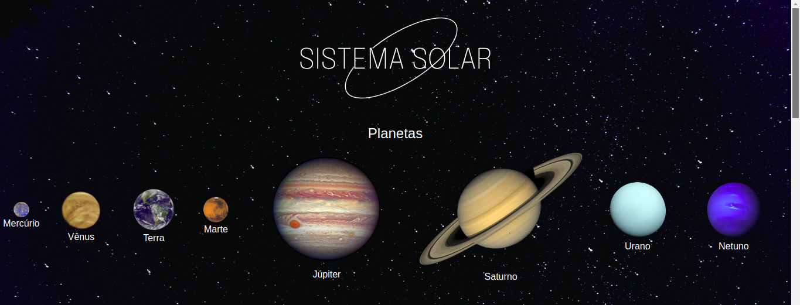
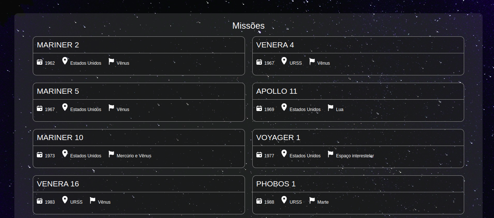

# Projeto Solar System

Este é um projeto proposto pela Trybe, no qual contém informações sobre o sistema solar como planetas existentes, e também uma lista das princpais missões espaciais já realizadas.

## Table of contents

- [Visão geral](#visão-geral)
  - [O desafio](#o-desafio)
  - [Screenshots](#screenshots)
  - [Deploy Link](#deploy-link)
- [Meu processo](#meu-processo)
  - [Construido com](#construido-com)
- [Autor](#autor)

## Visão geral

### O desafio

Funcionalidades:

- Renderização de uma lista com os planetas do Sistema Solar
- Renderização de uma lista com as missões espaciais

## Screenshots

### PC:

## Deploy Link

### Acesse o deploy do projeto na [Netlify](https://vmd-solar-system.netlify.app)

## Meu processo

### Construido com

- Semantic HTML5 markup
- CSS custom properties
- Flexbox
- Responsive Design
- [React.js](https://reactjs.org/)
- Typescript

## Autor

- Vinicius Melo: [LinkedIn](https://www.linkedin.com/in/vinicius-s-melo/)
